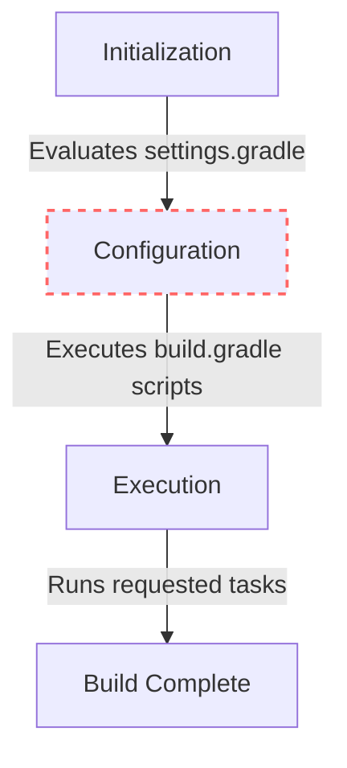

## The Common Error

If you've done Android development for more than a day, you've likely stared at a sea of red text in the Android Studio build window. One of the most common errors looks something like this:

```text
A problem occurred evaluating project ':app'.
> Failed to apply plugin 'com.android.internal.application'.
   > Android Gradle plugin requires Java 17 to run. You are currently using Java 11.
```

## Root Cause Explanation

This specific error occurs because there's a mismatch between the Java Development Kit (JDK) version your system is using to run Gradle and the version required by the Android Gradle Plugin (AGP). Modern versions of AGP (8.0+) strictly require Java 17.

## The Fix

You need to tell Android Studio to use the correct JDK for Gradle. 

1. Open Android Studio.
2. Go to **Settings** (or **Preferences** on macOS) > **Build, Execution, Deployment** > **Build Tools** > **Gradle**.
3. Under **Gradle JDK**, select a JDK 17 (or download one directly via the dropdown).

Also, ensure your `build.gradle` file is configured correctly for the target Java version:

```groovy
// app/build.gradle

android {
    compileOptions {
        sourceCompatibility JavaVersion.VERSION_17
        targetCompatibility JavaVersion.VERSION_17
    }
    kotlinOptions {
        jvmTarget = '17'
    }
}
```

## The Gradle Build Lifecycle

Understanding the Gradle lifecycle can help contextualize why these errors pop up:



The error we discussed happens during the **Configuration** phase (highlighted above with a dashed border) when Gradle attempts to apply the Android plugin to your `app` project. Fixing the JDK mismatch ensures Gradle can successfully configure the project before attempting any execution.
