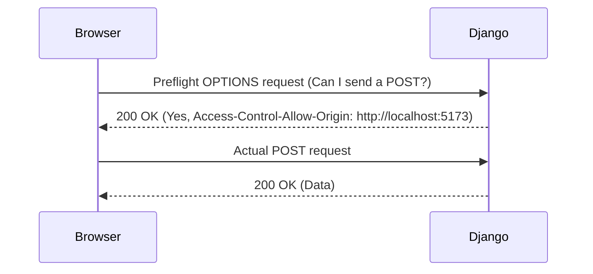

# Fix CORS Error in Django with React Vite Frontend

## The Problem

When you're building a modern web application with a decoupled architecture—like a React frontend built with Vite and a Django backend—one of the first roadblocks you'll hit is the dreaded CORS (Cross-Origin Resource Sharing) error. The browser blocks requests from your frontend (`localhost:5173`) to your backend (`localhost:8000`) for security reasons.

Here is what it typically looks like in the browser console:

```javascript
Access to fetch at 'http://localhost:8000/api/data/' from origin 'http://localhost:5173' has been blocked by CORS policy: No 'Access-Control-Allow-Origin' header is present on the requested resource.
```

## The Solution

To fix this, we need to tell Django to add the appropriate CORS headers to its responses. We can do this using the `django-cors-headers` package.

### 1. Install `django-cors-headers`

First, install the package using pip:

```bash
pip install django-cors-headers
```

### 2. Update `settings.py`

Next, add `corsheaders` to your `INSTALLED_APPS` and its middleware to your `MIDDLEWARE` list. **Crucially**, the `CorsMiddleware` must be placed as high as possible, especially before `CommonMiddleware`.

```python
# settings.py

INSTALLED_APPS = [
    # ... other apps
    'corsheaders',
    # ...
]

MIDDLEWARE = [
    'corsheaders.middleware.CorsMiddleware', # Add this high up!
    'django.middleware.security.SecurityMiddleware',
    'django.contrib.sessions.middleware.SessionMiddleware',
    'django.middleware.common.CommonMiddleware',
    # ...
]
```

### 3. Configure Allowed Origins

Finally, specify which origins are allowed to make cross-origin requests.

```python
# settings.py

CORS_ALLOWED_ORIGINS = [
    "http://localhost:5173",
    "http://127.0.0.1:5173",
]
```

## Request Flow

Here is a simple visualization of how CORS works:



And that's it! Your React app should now be able to happily communicate with your Django API.
