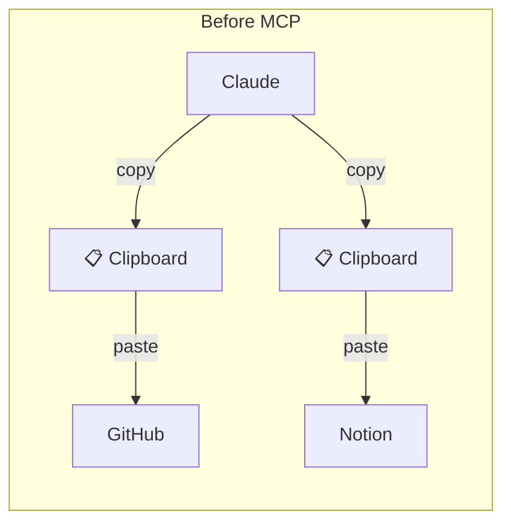
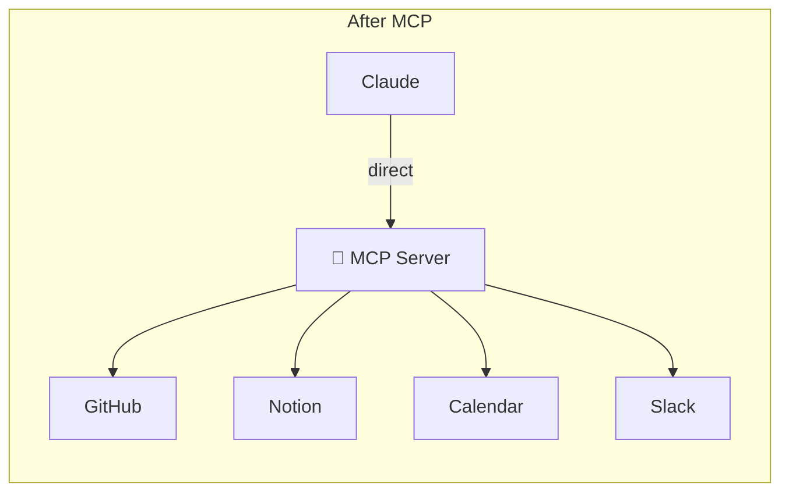

# What is MCP? A Beginner's Guide

Here's what my Tuesday looked like last month.

I was building a new feature for a side project. I opened Claude, described the feature in detail, and got a solid spec back. Great. Then I copied that spec, opened GitHub, created a new issue, pasted the spec, formatted it, added labels. Then I opened Notion, created a card on my kanban board, linked the GitHub issue, added a deadline. Then I went *back* to Claude, pasted the Notion link so it had context for the next conversation.

Three tools. One feature. Fifteen minutes of copy-paste. And I was doing this fifty times a week.

Then I heard about MCPs. It sounded like magic — "your AI can talk directly to GitHub and Notion." But what was it *actually*? I had to dig through docs, Discord threads, and half-baked tutorials to figure it out. This post is the guide I wish I had.

---

## What is MCP? (The Simple Explanation)

MCP stands for **Model Context Protocol**. That name is a mouthful, so let me translate:

**MCP is a standard that lets AI tools talk to external services directly.**

Think of it this way. Before MCP, using Claude (or any AI tool) with GitHub looked like this: you'd ask Claude to write something, copy the output, switch to GitHub, paste it in, then switch back. You were the middleware. The human clipboard.

After MCP, Claude talks to GitHub *directly*. No copy-paste. No tab-switching. No you in the middle.

Here's the flow:

The MCP server acts as a bridge. It exposes a set of **tools** — like "create an issue," "update a page," "list pull requests" — and the AI knows how to call them. The protocol is standardized, which means any AI tool that supports MCP can use any MCP server. GitHub MCP works with Claude, with Antigravity IDE, with any compliant client.

Here's the key insight: **MCPs are just a standard. The real magic is that your AI can now be an agent — it can decide what to do and execute it, instead of waiting for you to copy-paste.**

---

## Why MCPs Matter Right Now

For years, LLMs were impressive but ultimately passive. You'd ask a question, get an answer, and that was it. They were toys in a chat box. Smart toys, but toys.

That's changing. LLMs are becoming **agents** — systems that can reason about problems, break them into steps, and *take actions*. Not just "here's what you should do." But "I'll do it for you."

The problem? An agent stuck in a chat box is useless. It can think, but it can't *do* anything. It can't read your GitHub PRs. It can't update your Notion board. It can't check your calendar.

MCPs are the bridge. They tell the agent: "Here are the tools you can use. Go do it."

**An agent without MCPs is like hiring a brilliant employee who can't pick up the phone, write emails, or access any files.** They sit at their desk, full of ideas, but completely paralyzed. MCPs give the agent hands.

This is why the timing matters. The AI models got smart enough to be agents. Now they need the infrastructure to act. MCPs are that infrastructure.

Here's what agents can do when they have MCPs:

- **Autonomous code review** — read a PR, check test coverage, find bugs, suggest fixes. All without you opening GitHub.
- **Documentation generators** — read your code, generate docs, push them to a wiki. Automatically.
- **Data analysis pipelines** — fetch data from an API, analyze it, store results, notify your team on Slack.
- **Automated project management** — create issues, move kanban cards, update sprint boards. Based on what's actually happening in the codebase.

This isn't theoretical. I'm doing most of this right now.

---

## Real Examples (What I'm Actually Using)

Let me show you what my workflow looks like *after* setting up MCPs. These aren't hypotheticals — this is what I do daily.

### Example 1: GitHub Issues

I describe a feature in Claude or Antigravity IDE. Something like: "I need a blog post listing page with category filters, search, and pagination."

Claude uses the **GitHub MCP** to create a detailed issue automatically. Title, description, acceptance criteria, labels — all generated from my description. I review it. If it looks good, it's already on GitHub. If I want changes, I tell Claude, and it updates the issue in place.

No copy-paste. No formatting headaches. No forgetting to add labels.

**Before:** Feature spec → manually create GitHub issue (5 minutes of formatting) → hope I didn't miss anything.

**After:** Feature spec → Claude writes the issue → I review → done in 30 seconds.

### Example 2: Notion Boards

When a task is done, I ask Claude to update my kanban board. Claude uses the **Notion MCP** to find the card, read its current status, and move it from "In Progress" to "Done." Automatically. No manual drag-drop. No opening Notion at all.

I can also ask it to create new cards, update deadlines, or add notes — all from the same conversation where I'm writing code.

### Example 3: Planning Workflows

This is where it gets powerful. I use **Antigravity IDE** with Claude Opus to read GitHub issues (via MCP), understand the requirements, and write detailed implementation plans. It reads the issue, understands the codebase context, and produces a step-by-step plan with file changes, test cases, and edge cases to consider.

All without me jumping between tools. The AI has context from GitHub, context from the codebase, and context from our conversation. Everything in one place.

**The time savings are real:**

| Task | Before MCPs | After MCPs |
|---|---|---|
| Feature spec → GitHub issue | 5 min (copy-paste, format) | 30 sec (review + approve) |
| Update Notion kanban | 3 min (find card, drag, add notes) | 10 sec (one sentence to Claude) |
| Read issue + write impl plan | 15 min (tab-switching, context loading) | 2 min (Claude reads everything) |
| **Total per feature** | **~23 min of overhead** | **~3 min of overhead** |

Multiply that by 10 features a week, and I'm saving *hours*.

---

## The MCP Ecosystem (What Tools Are Available)

The ecosystem is growing fast. Here are the MCP servers that developers should know about:

| MCP Server | What It Does | Use Case |
|---|---|---|
| **GitHub** | Read/write issues, PRs, code, repos | Dev workflows, code reviews |
| **Notion** | Read/write databases, pages, kanban boards | Task tracking, documentation |
| **Google Calendar** | Create/update events, check availability | Meeting scheduling, standups |
| **Linear** | Issues, projects, sprint management | Dev team tracking |
| **Slack** | Post messages, read channel history | Team notifications, alerts |
| **Web Fetch** | Read any public web page | Research, monitoring, scraping |
| **File System** | Read/write local files | Code generation, analysis |
| **PostgreSQL** | Query databases directly | Data exploration, debugging |

These are just the public, open-source ones. Companies are building MCPs for internal tools too. Stripe has one. Figma has one. Sentry has one. Your company probably should too.

The pattern is simple: if your tool has an API, someone can (and probably will) wrap it in an MCP server. And once it's wrapped, any AI agent can use it.

---

## Common Questions

**Q: Is this just API integration with extra steps?**

Kind of, but standardized. Here's the difference: if you build a custom API integration, it works with *your* tool. If you build an MCP server, it works with *every* AI tool that supports MCP — Claude, Antigravity IDE, Cursor, VS Code, and whatever comes next. MCPs are a *protocol*, not a one-off integration.

**Q: Does this replace REST APIs?**

No. MCPs sit *on top of* APIs. The GitHub MCP server uses the GitHub REST API under the hood. MCP is a wrapper that makes APIs AI-friendly — it describes what tools are available, what parameters they need, and what they return. Think of it as a translation layer between "what the AI understands" and "what the API expects."

**Q: Is this secure?**

Yes, if configured correctly. MCP servers run on *your* machine (or your server). API tokens are stored locally — they're not shared with Claude's servers or anyone else. You have full control over what the AI can access. If you only give it read access to GitHub, it can only read. You set the boundaries.

**Q: Can I build my own MCP server?**

Absolutely. The MCP specification is open source. If you have an internal tool with an API, you can build an MCP server for it in a few hundred lines of code. I'll cover this in a future post — but the short version is: it's a JSON-RPC server that describes its tools and handles requests. Not rocket science.

---

## The Bigger Picture

This isn't just about saving time on copy-paste. Something bigger is happening.

**Automation is shifting left.** You're no longer just writing code — you're orchestrating AI agents that write code, manage projects, and handle workflows. Your job is shifting from "do the thing" to "define what the thing should be and let the agent do it."

**AI is becoming opinionated.** Instead of "here's a generic tool, figure out how to use it," we're moving toward "here's what the agent should do, and here's what it has access to." MCPs are the mechanism that makes this possible.

**Workflows are flattening.** Instead of jumping between GitHub, Notion, Slack, your IDE, and your terminal, everything consolidates into the AI layer. The AI becomes the interface. The tools become backends.

This isn't hype. Google, Anthropic, Stripe, and dozens of other companies are betting on this. Anthropic literally created the MCP standard. The infrastructure is being built right now, and the developers who learn it early will have a serious advantage.

---

## What's Next?

Setting up MCPs is easier than you think. In the next post, I'll walk through:

- **Setting up GitHub MCP** in Claude.ai (takes about 5 minutes)
- **Configuring it in Antigravity IDE** for a full agentic coding workflow
- **Fixing the Docker permission error** I hit during setup (so you don't have to)
- **Bonus: Setting up Notion MCP** for project management

By the end of the next post, you'll have MCPs running. You'll be creating GitHub issues from your AI tool. And then the real fun begins — because once you see what's possible, you'll never go back to copy-paste.

Ready? [Let's build.](/blog/mcp-vscode-setup)
