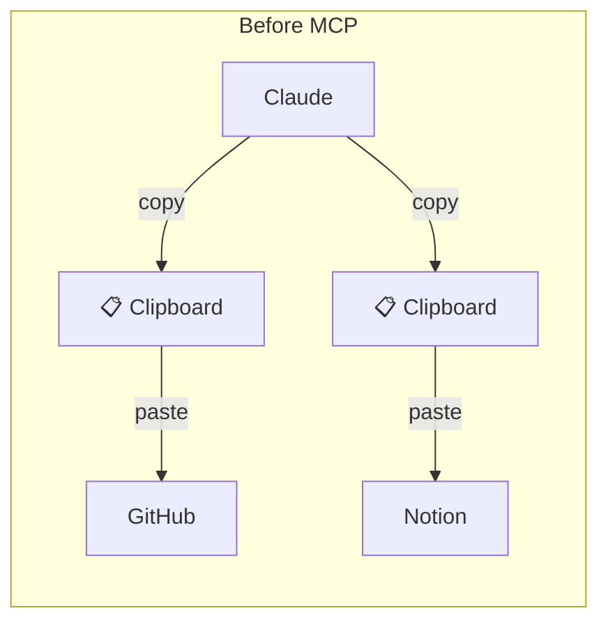
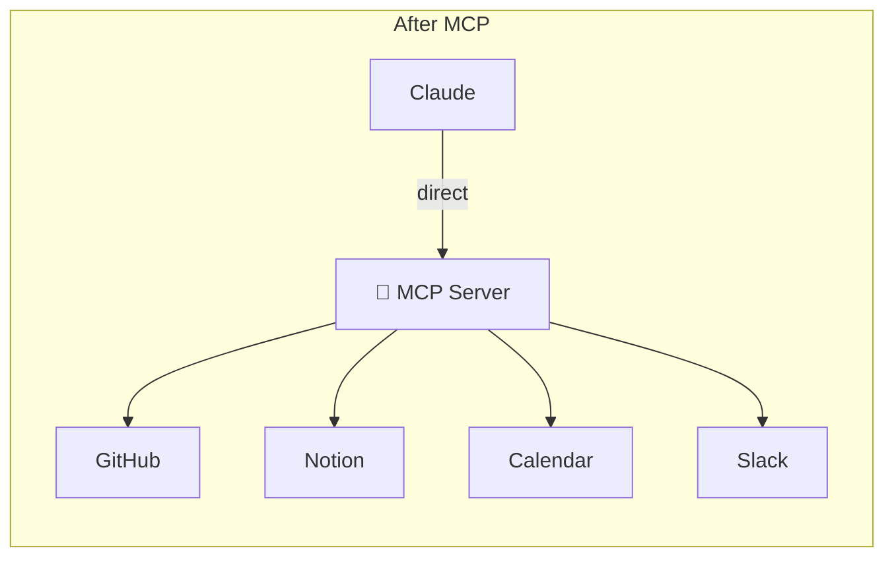

# What is MCP? A Beginner's Guide

There is a specific kind of mental exhaustion that comes from being a bridge between two smart tools.

I used to spend my hours in a loop. I would describe a feature in one window, copy the result, paste it into a GitHub issue, format the text, and then do it all over again for my project board. I was the middleware. A human clipboard moving data back and forth because my tools could not talk to each other.

I was doing this fifty times a week. It felt like I was an assistant to my own assistant.

Then I found the Model Context Protocol. It sounded like magic: "your AI can talk directly to GitHub and Notion." But what was it really? I had to dig through documentation, Discord threads, and fragmented tutorials to figure it out. This post is the guide I wish I had when I was stuck in that loop.

---

## What is MCP? (The Simple Explanation)

MCP stands for **Model Context Protocol**. While the name is formal, the concept is simple:

**MCP is a standard that lets AI tools talk to external services directly.**

Before this protocol, using an AI tool like Claude with GitHub followed a clumsy path. You would ask Claude to write something, copy the output, switch to GitHub, paste it in, and then switch back. You were the manual operator.

With the protocol, Claude talks to GitHub directly. There is no copying and pasting. There is no switching between tabs. You are no longer stuck in the middle.

Consider how the communication changes:

The server acts as a bridge. It exposes a set of **tools** such as "create an issue," "update a page," or "list pull requests." The AI knows how to call them. Since the protocol is standardized, any AI tool that supports it can use any server. The GitHub integration works with Claude, with the Antigravity IDE, or any other compliant client.

The key insight is that this is a breakthrough in agency. Your AI can now decide what to do and execute it, instead of waiting for you to handle the plumbing.

---

## Why this matters right now

For years, language models were impressive but ultimately passive. You would ask a question, get an answer, and the interaction ended. They were intelligent systems inside a box.

That is changing. These models are becoming **agents**: systems that can reason about problems, break them into steps, and take actions. They have moved from "suggesting what you should do" to "doing it for you."

The problem is that an agent stuck in a chat box is limited. It can think, but it cannot act. It cannot read your GitHub pull requests. It cannot update your Notion board. It cannot check your calendar.

The protocol provides the hands. It tells the agent: "Here are the tools you can use. You may now proceed."

**An agent without this infrastructure is like hiring a brilliant employee who cannot access any files or use the phone.** They sit at their desk, full of ideas, but completely paralyzed. This protocol gives the agent a way to interact with the world.

This is why the timing is critical. The models grew smart enough to be agents. Now they need the infrastructure to act.

Here is what agents can do when they have this access:

*   **Autonomous code review**: They can read a pull request, check tests, find bugs, and suggest fixes without you ever opening GitHub.
*   **Documentation updates**: They can read your code, generate documentation, and push it to a wiki automatically.
*   **Data analysis**: They can fetch data from an API, analyze it, store the results, and notify your team on Slack.
*   **Project management**: They can create issues and update story boards based on what is actually happening in the code.

I am using these workflows every day.

---

## Real examples from my daily work

Let me show you how my workflow changed. These are not hypothetical scenarios; this is my reality after setting up the protocol.

### Example 1: Creating GitHub issues

I describe a feature in my editor. I might say: "I need a blog listing page with category filters, search, and pagination."

Claude uses the **GitHub MCP** to create a detailed issue automatically. It generates the title, description, and labels from my brief request. I review the text. If it looks correct, it is already on GitHub. If I want changes, I tell the AI, and it updates the issue.

There is no formatting work. There is no manual entry.

**Before**: Create a spec, then manually create a GitHub issue, then hope I did not miss a detail.

**After**: Describe the idea, review what the AI wrote, and finish in seconds.

### Example 2: Managing Notion boards

When a task is finished, I ask Claude to update my board. Claude uses the **Notion MCP** to find the card, read the current status, and move it to "Done." It happens automatically. I do not have to open Notion.

I can also ask it to create new cards or update deadlines from the same conversation where I am writing code.

### Example 3: Planning workflows

This is where the power becomes obvious. I use the **Antigravity IDE** to read GitHub issues, understand the requirements, and write detailed implementation plans. It reads the issue, understands the context of the codebase, and produces a step by step plan with file changes and test cases.

The AI has context from GitHub, context from the code, and context from our conversation. Everything is in one place.

**The time savings are significant:**

| Task | Manual Workflow | Connected Workflow |
|---|---|---|
| Feature spec to GitHub issue | 5 minutes of copy and paste | 30 seconds to review |
| Update Notion cards | 3 minutes of navigation | 10 seconds to speak |
| Read issue and write plan | 15 minutes of switching tabs | 2 minutes for the AI to read |
| **Total per feature** | **23 minutes of overhead** | **3 minutes of overhead** |

Multiply that by ten features a week, and I am saving several hours of clerical work.

---

## The growing ecosystem

The ecosystem is expanding rapidly. Here are the servers that developers should know about:

| Server | Capability | Primary Use |
|---|---|---|
| **GitHub** | Read and write issues, pull requests, and code | Developer workflows and reviews |
| **Notion** | Manage databases, pages, and boards | Task tracking and documentation |
| **Google Calendar** | Manage events and check availability | Scheduling and standups |
| **Linear** | Manage issues and projects | Team tracking |
| **Slack** | Post messages and read history | Team communication |
| **Web Fetch** | Read public web pages | Research and monitoring |
| **File System** | Read and write local files | Code generation and analysis |
| **PostgreSQL** | Query databases | Debugging and data exploration |

These are the public versions. Companies are also building internal servers for specialized tools. If a service has an API, it can be wrapped in this protocol. Once that happens, any AI agent can use it.

The interface is becoming the AI layer. The tools are becoming the backends.

---

## Common Questions

**Is this just API integration with extra steps?**

It is a standardized way to handle integrations. If you build a custom integration, it only works for one tool. If you build a server using this protocol, it works with every AI tool that supports it. It is a protocol, not a one off script.

**Does this replace REST APIs?**

No. These servers sit on top of APIs. The GitHub server uses the GitHub API under the hood. The protocol is a translation layer that makes APIs friendly for AI agents. It describes what tools are available and what parameters they need in a language the AI understands.

**Is this secure?**

Yes, because the servers run on your own machine. Your API tokens are stored locally. They are not shared with the AI providers. you have full control over what the AI can see and do.

**Can I build my own?**

Absolutely. The specification is open. If you have an internal tool, you can build a server for it in a few hundred lines of code. It is a standard communication protocol that describes tools and handles requests.

---

## The bigger picture

This is not just about saving time. A fundamental shift is happening.

**Automation is moving closer to the developer.** You are no longer just writing code. You are orchestrating agents that help you manage projects and handle workflows. Your role is shifting from "performing every task" to "directing the outcome."

**Workflows are becoming seamless.** Instead of jumping between multiple tools and your terminal, everything consolidates. The AI becomes the primary interface.

This is why companies like Google and Anthropic are investing so heavily in this standard. The infrastructure for a new way of working is being built right now. The developers who adopt these patterns early will have a profound advantage.

---

## What comes next?

Setting up these tools is faster than you might expect. In my next post, I will walk through the practical steps:

*   **Setting up GitHub integration** in your preferred AI tool.
*   **Configuring the Antigravity IDE** for a connected workflow.
*   **Resolving common setup issues** such as permission errors.
*   **Bonus: Connecting Notion** for automated project management.

By the end of the next guide, you will have these agents running. You will be creating GitHub issues from your conversation window. And once you experience that freedom, you will never want to go back to the human bridge.

Ready? [Let's build.](/blog/mcp-vscode-setup)
